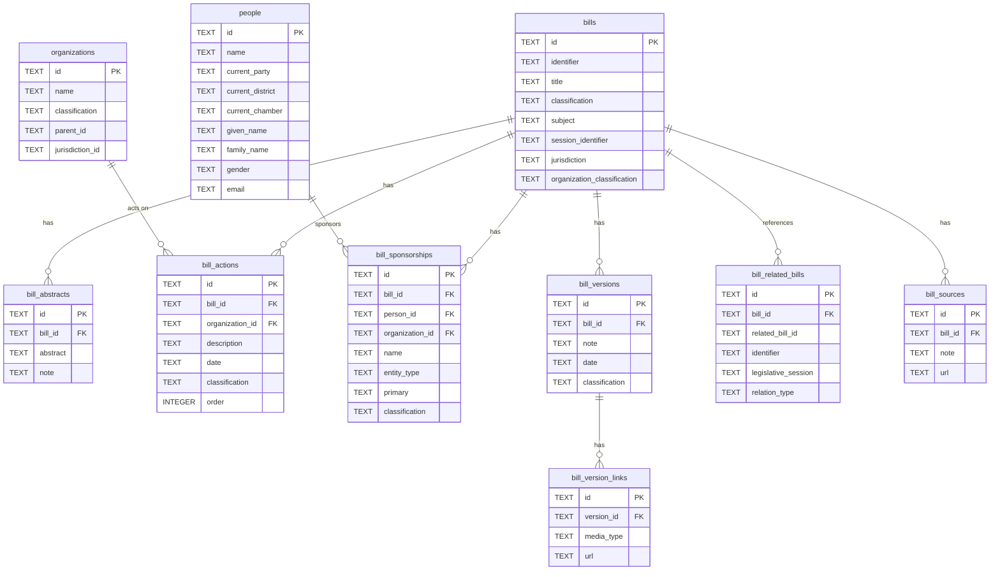

# Entity-Relationship Diagram

```mermaid
erDiagram
    people {
        TEXT id PK
        TEXT name
        TEXT current_party
        TEXT current_district
        TEXT current_chamber
        TEXT given_name
        TEXT family_name
        TEXT gender
        TEXT email
    }

    organizations {
        TEXT id PK
        TEXT name
        TEXT classification
        TEXT parent_id
        TEXT jurisdiction_id
    }

    bills {
        TEXT id PK
        TEXT identifier
        TEXT title
        TEXT classification
        TEXT subject
        TEXT session_identifier
        TEXT jurisdiction
        TEXT organization_classification
    }

    bill_abstracts {
        TEXT id PK
        TEXT bill_id FK
        TEXT abstract
        TEXT note
    }

    bill_actions {
        TEXT id PK
        TEXT bill_id FK
        TEXT organization_id FK
        TEXT description
        TEXT date
        TEXT classification
        INTEGER order
    }

    bill_sponsorships {
        TEXT id PK
        TEXT bill_id FK
        TEXT person_id FK
        TEXT organization_id FK
        TEXT name
        TEXT entity_type
        TEXT primary
        TEXT classification
    }

    bill_versions {
        TEXT id PK
        TEXT bill_id FK
        TEXT note
        TEXT date
        TEXT classification
    }

    bill_version_links {
        TEXT id PK
        TEXT version_id FK
        TEXT media_type
        TEXT url
    }

    bill_related_bills {
        TEXT id PK
        TEXT bill_id FK
        TEXT related_bill_id
        TEXT identifier
        TEXT legislative_session
        TEXT relation_type
    }

    bill_sources {
        TEXT id PK
        TEXT bill_id FK
        TEXT note
        TEXT url
    }

    bills ||--o{ bill_abstracts : "has"
    bills ||--o{ bill_actions : "has"
    bills ||--o{ bill_sponsorships : "has"
    bills ||--o{ bill_versions : "has"
    bills ||--o{ bill_related_bills : "references"
    bills ||--o{ bill_sources : "has"
    bill_versions ||--o{ bill_version_links : "has"
    people ||--o{ bill_sponsorships : "sponsors"
    organizations ||--o{ bill_actions : "acts on"
```
